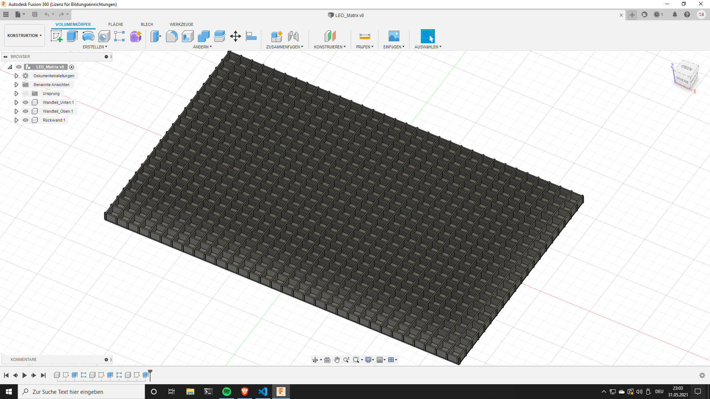

# LED Matrix

## Einleitung

Die LED Matrix gehört technisch gesehen, noch zur LED Beleuchtung, hat aber mitlerweile eine solche Komplexität erreicht, sodass es sinnvoll ist, sie hier nochmal ausführlich zu beschreiben. Die LED Matrix wird ein tolles Gimmik für unseren Partykeller, unzwar ein großer Audio Spektrograph. Die Steuerung der Matrix wird mit dem Mischpult unserer Surround-Anlage verbunden und zeigt in verschiedenen einstellbaren Effekten das Frequenzspektrum der Musik.


## Hardware

### Ursprünglicher Entwurf

Ursprünglich wollte ich die LED Matrix nur mit einem Arduino betreiben. Adafruit stellt eine Bibliothek mit Funktionen bereit, die eine FFT Operation berechnen können. Der "Fast Fourier Transform (FFT)" ist ein mathematischer Algorythmus, mit dem ein Computer aus den Messpunkten eines Zeitsignals (Musik) das Frequenzspektrum berechnen kann.

Auf die Fourier Transformation möchte ich in einem seperaten Artikel nochmal ganuer eingehen, weil dieses Thema sehr komplex ist und ich hier in erster Linie die Matrix und Steuerung dokumentieren will.

Der Arduino sollte also die Messpunkte mit dem integrierten AD Wandler aufnehmen, diese mit dem FFT Algorythmus verarbeiten und das Ergebnis auf der Matrix ausgeben. Dafür habe ich einen kleinen Prototypen gebaut. Dieser hat auch perfekt funktioniert.


Diese Herangehensweise hat nur einen Haken. Je größer die Matrix, desto langsamer wird die Wiederholrate der Anzeige, weil die Berechnungen und das Ansteuern der Matrix Zeit brauchen und nicht parallel ablaufen können. Mit diesem kleinen Prototypen ist das noch kein Problem, aber wenn ich die große Matrix mit dieser Steuerung betreibe, habe ich nur noch eine Diashow.

### Matrix

Für die Matrix verwende ich, wie bei den LED Streifen auch, die WS2812B RGB LEDs (Neopixel). Jeder Spalte bildet ein Frequenzband. Im aktuellen Enwurf liegt die Größe bei 32 Spalten auf einer Höhe von 20 LEDs. Die einzelnen Kacheln sind 7cm auf 7cm. Die LEDs jeder Spalte werden in Serie verkabelt, sodass jede Spalte parallel angesteuert werden kann.

Matrix wird noch gebaut. Das ist aktuelle CAD Entwurf:




### Arduino

Das Arduino Board, das ich hier verwende, ist nicht so verbreitet wie der UNO oder NANO aber perfekt für Signalverarbeitung. Der MKR Vidor 4000 ist ein Development Board, auf dem ein Mikrocontroller (SAM21) und ein FPGA (Intel Cyclone 10) verbaut sind.

Ein FPGA ist ideal für dieses Projekt, da ich alle Aufgaben (außer das samplen mit dem ADC) auf dem FPGA parallel betreiben und wie eine Pipeline behandeln kann. Das ist vor allem für die Ansteuerung der Matrix wichtig, da ich jetzt nicht einen einzelnen großen Streifen ansteuern muss, der die Matrix bildet, sondern für jede einzelne Spalte der Matrix, einen seperaten Streifen benutzen und alle parallel ansteuern kann.


Der Mikrocontroller gibt ein 24MHz Taktsignal für den FPGA aus. Das sollte für die Berechnung reichen, da für die parallele Ansteuerung ein wesentlich niedrigeres Taktsignal ausreicht.

### Audiosampling

Die Musik muss so vorbereitet werden, dass sie von den AD-Wandlern des Arduinos gemessen und verarbeitet werden kann. Der Arduino hat einen Messbereich von 0V bis 5V und kann keine negativen Spannungen messen. Der Klinkenstecker eines Handys schafft etwa ±150mV.

Ich hab also einen Audio Verstärker entworfen, der die Spitzen von bis zu 150mV auf Spitzen von bis zu 2.5V verstärken kann und der Ausgangsspannung einen Offset von 2.5V gibt. Somit bewegt sich die Spannung um den Mittelpunkt des Messbereiches von 0V bis 5V. Ich verwende einen ICL7660 Spannungsinvertierer/-converter um den Operationsverstärker zu versorgen.


### Signalverarbeitung

Der Arduino nimmt mit dem integrierten AD Wandler die Messpunkte auf und überträgt diese mit UART auf den FPGA. Dieser verarbeitet mit die Messpunkte mit dem FFT Algorythmus und Steuert die Spalten der Matrix mit dem Ergebnis an.

Alle Verarbeitungsschritte sind in Reihe angelegt, sodass sie eine Pipeline bilden. Bedeutet wenn zum Beispiel gerade die Werte auf der Matrix ausgegeben werden, rechnet der FFT Block schon die nächsten Samples. Es entsteht also ein ununterbrochener Datenfluss.


## Software

Um den FPGA zu programmieren, benutze ich Verilog, ich bin zwar über die Hochschule auch mit VHDL vertraut, finde aber den Syntax von Verilog wesentlich besser und ich mag die Nähe zur Programmiersprache C. Ich habe das Programm für den FPGA auf mehrere Module aufgeteilt:

* npxl_treiber: Treibermodul für die LED Streifen
* npxl_controller: Liest Farbdaten ein und gibt sie über die Streifen aus
* ROM: Speichert momentan feste Farbmuster für die Balkenanzeige des FFT Outputs
* RAM: Blockram als Zwischenspeicher für FFT Werte
* uart_rx: UART Empfänger um ADC Daten vom Mikrocontroller zu empfangen
* FFT: FFT Megafunktion (von Gisselquist, Link unten)
* spektrometer: Top-Modul für das FPGA programm, bindet alle obigen Sub-Module ein


### Neopixel Treiber

Die Basis der Anzeige ist der npxl_treiber. Dieses Modul ließt den 24Bit Farbcode für jede LED ein und sendet alles an den Streifen. Ist das Ende des Streifens errecht wird die Datenleitung für 50µs auf GND gezogen um die Farben anzuzeigen. Im inneren des Moduls befindet sich ein Automatenkonstrukt, das das Lesen und Senden der einzelnen Bits koordiniert.

Wird der die "send" Leitung aktiviert, gibt der Block an "o_color_reg" eine Speicheradresse aus, die dem Index der LED entspricht. Ist ein Speicher mit dem Modul verbunden, werden die Farbdaten, die am Eingang "i_color_data" anliegen in ein Puffer-Register eingelesen und der Reihe nach an "o_npxl_data" ausgegeben. In der Definition des Blocks wird fest vorgegeben, wie viele LEDs er abarbeiten muss.


Wenn der Block über die Speicheradressen looped, gibt er deren Inhalt an die LED-Streifen aus. Für jedes Bit, das ausgegeben wird, gibt es Timing Bedingungen, die bestimmen ob eine 1 oder 0 gesendet wird. Diese Zeiten können dem Datenblatt entnommen werden. Fürs erste wird an den Treiberblock nur ein ROM angeschlossen sein, das feste Farbdaten enthält, aber zulässt, dass nur LEDs bis zu einer bestimmten Höhe erleuchtet werden.


### Neopixel Controller

Der npxl_controller importiert den npxl_treiber und ein ROM Modul. Die Außführung dieses Modul kann sich in der Zukunft noch ändern. In seiner jetzigen Form aber ließt es einen Höhenwert ein und lässt dementsprechend viele LEDs mit einer festen Farbe in einer Spalte aufleuchten. Das bildet die Pegelanzeige für das Ergebnis der FFT Operation.

Das ROM besitzt doppelt so viele Speicheradressen, wie sich LEDs in der Spalte befinden. Die untere Hälfte der Adressen sind mit den Farben für die LEDs beschrieben. In der oberen Hälfte stehen nur Nullen. Die Farbdaten werden vom npxl_treiber von dem ROM ausgelesen. Ist der Höhenwert erreicht, wird der Adresse des npxl_treiber ein Offset hinzugefügt, das den Block den oberen Adressraum des ROMs lesen lässt, also die LEDs ausschaltet.


### UART RX

Das uart_rx Modul ist dafür zuständig, die Samples vom Mikrocontroller zu empfangen und über ein Register zur FFT Megafunktion weiterzuleiten. Das Protokoll für UART ist relativ einfach aufgebaut.

Sender und Empänger müssen im Vorfeld die gleichen Einstellungen für die Übertragung haben. Die Sendegeschwindigkeit, oder Baudrate (hier 115200), die Anzahl der Bits (hier 8) und ob ein Partäts-Bits vewendet wird. Der Ausgangszustand für UART ist HIGH (5V). 

Zuerst wird eine Startbedingung bzw. ein Startbit gesendet. Dies zeichnet sich durch eine negative Taktflanke aus mit einer Haltezeit, die der Baudrate entspricht. Wenn das UART Startbit erkannt wird, erwartet der Empfänger 8 Datenbits und prüft dann ob ein Stopbit gesendet wurde, um die Übertragung zu bestätigen. Diese werden immer im Mittelpunkt der Taktzeit gescant.


Nach einer erfolgreichen Übertragung liegen die Daten am Ausgangsregister an und ein data-valid Signal wird gesetzt. Intern wird die Koordination dieser Schritte über ein Automatenkonstrukt geregelt.


### FFT Megafunktion

Eine Hardwarebasierte FFT Operation zu entwerfen ist eine große und sehr komplizierte Aufgabe. Um mir die Arbeit zu erleichtern habe ich nach einem vorhandenen FFT Kern gesucht.

Unten verlinkt ist der Open Source FFT Kern von Gissquist. Er stellt einen FFT Kern Generator, auf Github, zu Verfügung, der sich über Kommandozeilenparameter anpassen lässt. Auf seiner Webseite ist der Aufbau und die Funktionsweise des Kerns exellent beschrieben und ich bin froh, dass ich das Projekt gefunden habe.

```command
$ ./fftgen -h
USAGE:	fftgen [-f <size>] [-d dir] [-c cbits] [-n nbits] [-m mxbits] [-s]
	-1	Build a normal FFT, running at one clock per complex sample, or
		(for a real FFT) at one clock per two real input samples.
	-a <hdrname>  Create a header of information describing the built-in
		parameters, useful for module-level testing with Verilator
	-c <cbits>	Causes all internal complex coefficients to be
		longer than the corresponding data bits, to help avoid
		coefficient truncation errors.  The default is 4 bits longer
		than the data bits.
	-d <dir>  Places all of the generated verilog files into <dir>.
		The default is a subdirectory of the current directory
		named fft-core.
	-f <size>  Sets the size of the FFT as the number of complex
		samples input to the transform.  (No default value, this is
		a required parameter.)
	-i	An inverse FFT, meaning that the coefficients are
		given by e^{ j 2 pi k/N n }.  The default is a forward FFT, with
		coefficients given by e^{ -j 2 pi k/N n }.
	-k #	Sets # clocks per sample, used to minimize multiplies.  Also
		sets one sample in per i_ce clock (opt -1)
	-m <mxbits>	Sets the maximum bit width that the FFT should ever
		produce.  Internal values greater than this value will be
		truncated to this value.  (The default value grows the input
		size by one bit for every two FFT stages.)
	-n <nbits>	Sets the bitwidth for values coming into the (i)FFT.
		The default is 16 bits input for each component of the two
		complex values into the FFT.
	-p <nmpy>  Sets the number of hardware multiplies (DSPs) to use, versus
		shift-add emulation.  The default is not to use any hardware
		multipliers.
	-s	Skip the final bit reversal stage.  This is useful in
		algorithms that need to apply a filter without needing to do
		bin shifting, as these algorithms can, with this option, just
		multiply by a bit reversed correlation sequence and then
		inverse FFT the (still bit reversed) result.  (You would need
		a decimation in time inverse to do this, which this program does
		not yet provide.)
	-S	Include the final bit reversal stage (default).
	-x <xtrabits>	Use this many extra bits internally, before any final
		rounding or truncation of the answer to the final number of
		bits.  The default is to use 0 extra bits internally.
```

Neben den optimalen Parametern für mein Projekt, habe ich noch einen Wrapper um den Kern herum entworfen. Der Kern ist als Pipeline konfiguriert mit nur minimalen Steuersignalen. Damit ich ein gewisses Maß an Flowcontroll mit dem Kern habe, möchte ich ihn in einer Burst Konfiguration benutzen.

Der Kern erwartet einen kontinuierlichen Strom von Datensamples und gibt die Berechneten Punkte kontinuierlich aus. Es gibt nur ein Kontroll-Signal, mit dem die Berechnungen unterbrochen werden können. Für die Koordination mit den LED Treibern brauche ich Signale, die Anfang und Ende des Blocks aus 512 Samplen markieren.


Mit dem Wrapper wiederum wartet der Kern nun bis er alle Samples für eine Berechnung hat, dann werden alle Messpunkte umgerechnet. Während des Berechnungsphase werden keine neuen Samples angenommen. Ist die Berechnung fertig, wird das Ergebniss ausgegeben und neue Samples können eingegeben werden. Es wird also immer Etappenweise oder in Burst Konfiguration gerechnet.

Zusätzlich hat der Wrapper noch Signale, die anzeigen wann er rechnet und wann Daten geschrieben und gelesen werden können. Als Input nimmt der Block 8 Bit breite Datensamples für jewails die Realen und Komplexen Werte, also 16 Bit. Die Komplexen Werte sind für meine Anwendung nicht relevant, da ich keine genauen Rechenwerte erzielen will, sondern nur einen tollen Effekt zur Musik.


### Spektrometer

Das spektrometer Modul fügt alle Bausteine zusammen und ist das Modul, das letztendlich auf den FPGA geflasht wird. Alle Module koordinieren sich untereinander mit Ready- und Startsignalen. Zwischen dem Output der FFT Funktion und den Eingängen der npxl_controller befindet sich noch ein Verteiler, der einen Datensatz einließt und diesem ausgewählte Punkte entnimmt, die auf der Matrix angezeigt werden sollen, denn die Matrix hat eine Breite von 32 Streifen auf der 512 Datenpunkte verteilt werden.


## Sourcecode

Das war jetzt eine ganz schöne Wand von Text. Ich hoffe das Projekt findet ein bischen Aufmerksamkeit auf GitHub und ich freue mich über Kommentare und Verbesserungsvorschläge. Das Repository ist unten verlinkt zusammen mit der Seite von Gisselquist. Schaut unbedingt mal auf seine Seite. Er hat den FFT Algorythmus ausführlich und gut verständlich erklärt.

[Projekt Repository](https://github.com/SebastianBraun01/vu_meter)
[Gisselquist Seite](https://zipcpu.com/dsp/2018/10/02/fft.html)
[Adafruit Seite](https://learn.adafruit.com/adafruit-neopixel-uberguide/arduino-library-use)
